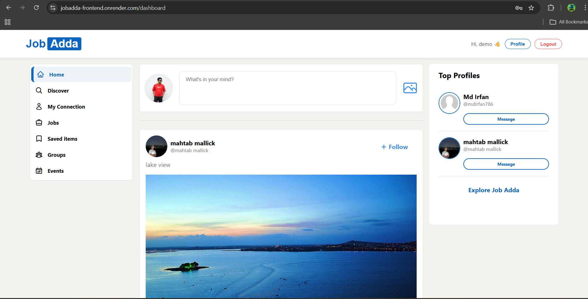
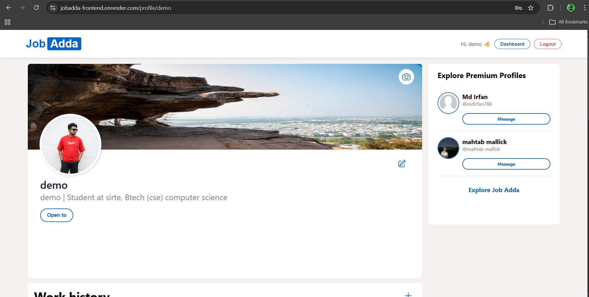
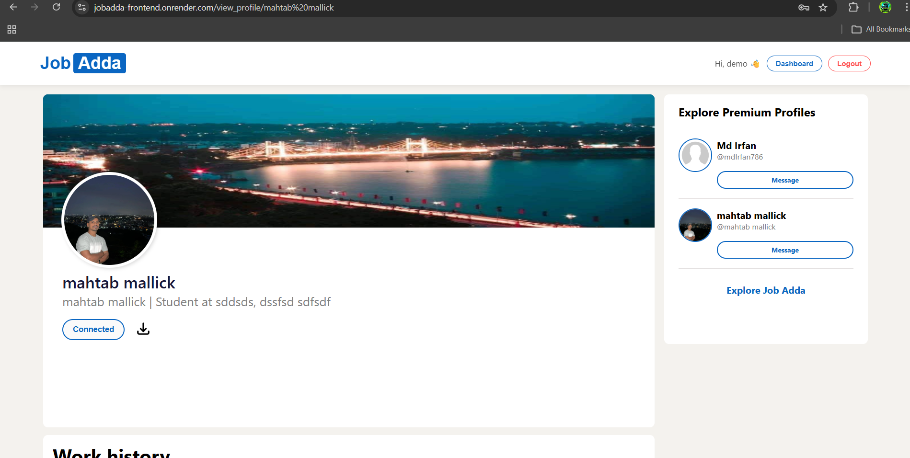
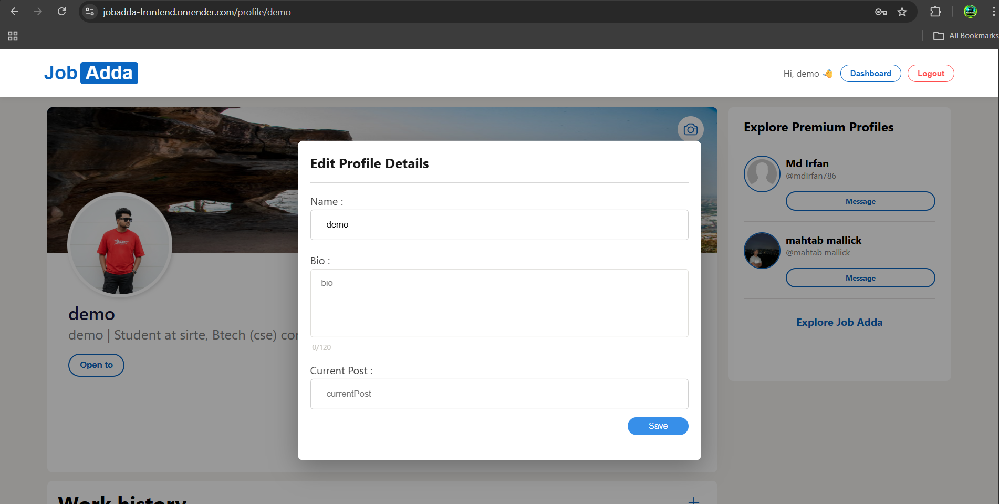
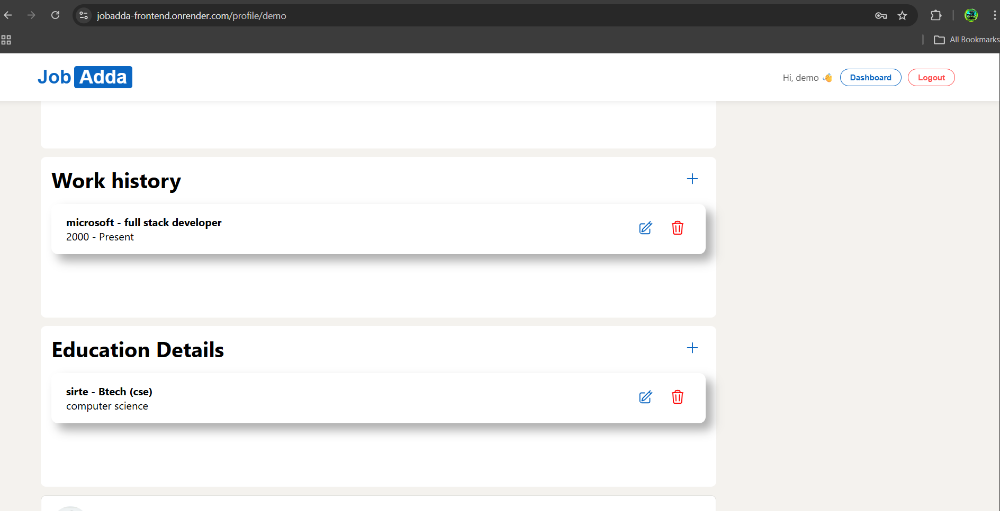
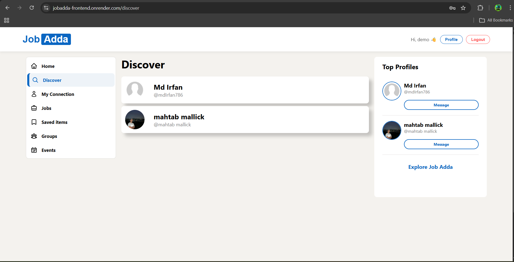
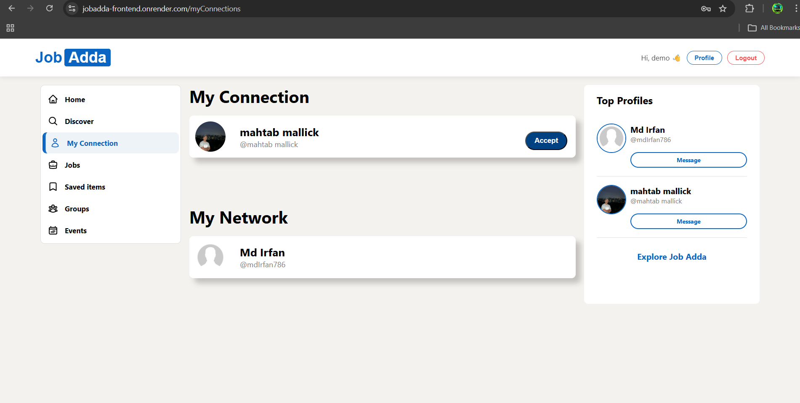

# JobAdda 🚀

A full-stack professional networking platform inspired by LinkedIn.

## 🌍 Live Deployment

| Service     | Link                                                                           |
| ----------- | ------------------------------------------------------------------------------ |
| Frontend    | [https://jobadda-frontend.onrender.com](https://jobadda-frontend.onrender.com) |
| Backend API | [https://jobadda-backend.onrender.com](https://jobadda-8rmh.onrender.com)      |

> ⚠️ Note: If deployed on free hosting (Render), the first request may take 30–60 seconds due to cold start.

---

JobAdda allows users to create profiles, share posts, like & comment, connect with other users, and manage their professional journey including work history and education — all with a secure, scalable, and well-structured backend.

---

## 📸 Screenshots

### 🏠 Home Feed


### 🏠 Dashboard Feed



---

### 👤 User Profile

#### Profile View



#### Other Profile



#### Edit Profile



#### Work Details



---

### 🔎 Discover



---

### 🤝 Connections



## 🔥 Features

### 👤 Authentication & Security

- JWT-based authentication
- Centralized authentication middleware  
  (no token passing via body or query params)
- Secure HTTP headers using **Helmet**
- Proper CORS configuration for controlled origins
- Global error handling middleware

---

### 🧑‍💼 User Profile

- Create & update user profile
- Upload profile picture & background image
- Add / update / delete:
  - Work history
  - Education details
- View own & other users’ profiles

---

### 📝 Posts & Engagement

- Create posts (text + image)
- Like posts
- Comment on posts
- Delete own posts & comments
- Share post links

---

### 🤝 Connections

- Send connection requests
- Accept / reject requests
- View sent & received requests
- Connected / Pending states handled cleanly

---

## 🛠️ Tech Stack

### Backend

- **Node.js**
- **Express.js**
- **MongoDB** with **Mongoose**
- **JWT** for authentication
- **Helmet** for security headers
- **Multer** for image uploads

### Frontend

- **Next.js**
- **React**
- **Redux Toolkit**
- **Axios**
- **CSS Modules**

---

## 🧱 Architecture Highlights

- Modular and scalable backend architecture
- Centralized authentication middleware
- Controllers free from direct token dependency
- Clean separation of:
  - Routes
  - Controllers
  - Middleware
  - Models
- Global error handler for consistent API responses

---

## 🔐 Security Improvements (Recent Refactor)

- Removed token usage from:
  - Request body
  - Query parameters
- Authentication handled entirely via middleware
- Added **Helmet** for secure HTTP headers
- Implemented global error handling
- Refactored codebase for better maintainability

---

## 📁 Project Structure (Backend)

backend/
│
├── middleware/
│ ├── authMiddleware.js
│
├── model/
│ ├── user.model.js
│ └── posts.model.js
|
├── routes/
│ ├── user.routes.js
│ └── posts.routes.js
│
├── controllers/
│ ├── user.controller.js
│ └── posts.controller.js
│
├── uploads/
│
├── server.js
└── .env

---

## ⚙️ Environment Variables

Create a `.env` file in backend root:

```env
PORT=7870
MONGO_URL=your_mongodb_connection_string
LOCAL_URL=http://localhost:3000
FRONTEND_URL=http://localhost:3000
JWT_SECRET_KEY=your_secret_key

```

## ▶️ Run Locally

Backend:

```Backend

cd backend
npm install
npm run dev
```

Frontend:

```Frontend

cd frontend
npm install
npm run dev
```
